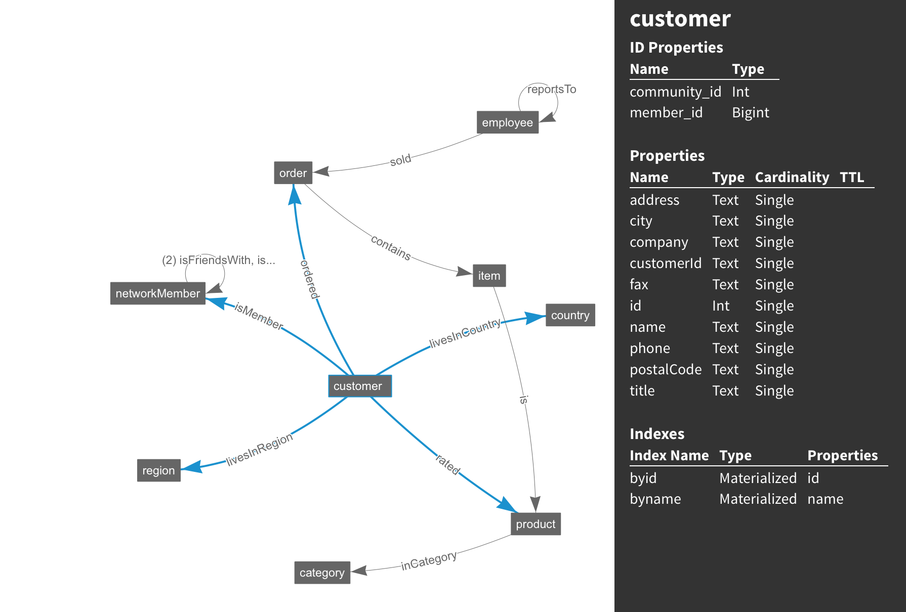

# Northwind

The Northwind graph example is a subset of Microsoft's Northwind dataset found [here](https://northwinddatabase.codeplex.com).
The data has been prepared and serialized with the [Kryo](http://tinkerpop.apache.org/docs/current/reference/#gryo-reader-writer) format in the data directory.  It is to be used as a learning tool for 
translating SQL queries to gremlin traversals as featured on the [sql2gremlin](http://sql2gremlin.com) page.  Once you've loaded the data, you will be able to run the various example traversals from the *sql2gremlin* page in Studio or on the gremlin console.
However, while using DSE Graph in Development mode, you'll have to explicitly enable use of scans and lambdas to run the examples that require those<sup>1</sup>:

```
    schema.config().option('graph.allow_scan').set('true')
    graph.schema().config().option('graph.traversal_sources.g.restrict_lambda').set(false)
```
<sup>1</sup> note that scans are disabled by default for performance reasons; lambdas are disabled by default for both performance reasons and security concerns

You can choose to let it create the schema for you (default) or you can create the schema explicitly (recommended for Production) and
load the data with `create_schema` set to **false** in the script or from the command-line.

## Datamodel visualization

View the live schema visualization <a href="https://s3.amazonaws.com/datastax-graph-schema-viewer/index.html#/?schema=northwind.json" target="_blank">here</a>
[](https://s3.amazonaws.com/datastax-graph-schema-viewer/index.html#/?schema=northwind.json)<br/>

## Example loading

If you load the Kryo file from within the northwind directory, you don't need to specify the path.  It will
default to the data subdirectory to get the northwind.kryo file.  Otherwise, specify the full path with the
`inputfile` parameter.

Examples of loading the northwind data:

```
# From the northwind directory
graphloader -graph northwind -address localhost northwind-mapping.groovy
```

```
graphloader -graph northwind -address localhost northwind-mapping.groovy -inputpath ~/repos/graph-examples/northwind/data/
```

## Supplemental data

Some supplemental data has been added in csv files to provide some more connectivity within the data.  It is generated data,
that includes things like relationships between customers (isRelatedTo and isFriendsWith), customer product ratings (rated),
and so forth.  The relationships include the relationship type, the friendships include an affinity score, and the identities
come with a confidence level to make the relationships more interesting to play with.

Examples of loading the supplemental data:

```
# From the northwind directory
graphloader -graph northwind -address localhost supplemental-data-mapping.groovy
```

```
graphloader -graph northwind -address localhost supplemental-data-mapping.groovy -inputpath ~/repos/graph-examples/northwind/data/
```
